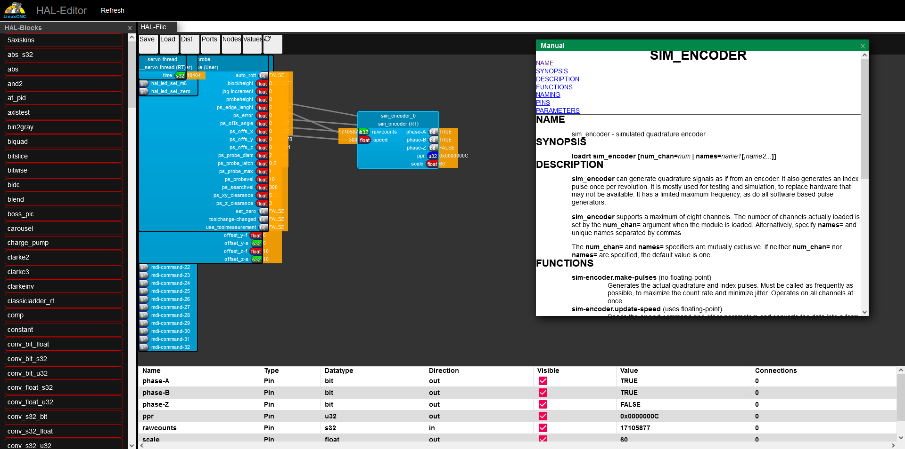
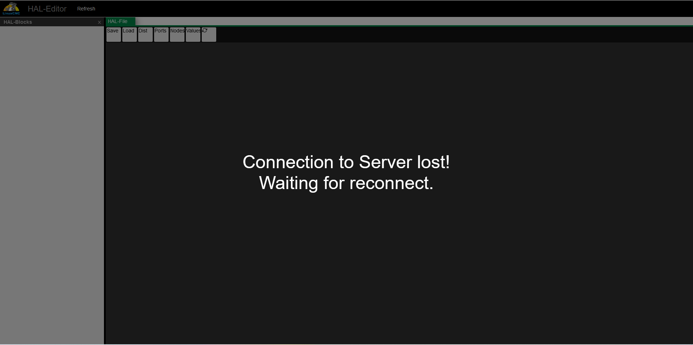

# LinuxCNC-HalViewer

In this repo you will find a webbased userinterface for configuring HAL files.

At the moment it has proof of concept status, there is no propper error handling and so on.

Currently following actions are supported:
- Show all available HAL components and view manuals
- Add components to HAL (only Realtime) - multiple instances are not supported
- Connect by drag and drop
- Show current HAL values

How it works:
the complete system is based on node.js.
There are two components
- a Server to provide a static webpage (default on Port 9000) - this can run anywhere in the network.
- a second Server component which connects to HAL and provides an interface with socket.io (default on Port 8070) - this component has to run on the linuxcnc machine.
The nodes, ports, ... are rendered on the client side, the socket.io connection is used to get list of Pins, Nodes, Values, ... and send commands to HAL.

How to start:
- install node.js / npm on the machines where the components should run.
- copy this Repo on your machine
- run the command "npm install" inside the folder to installl dependancies
- to test the environment open "127.0.0.1:9000" or "0.0.0.0:9000" in your Browser.
- the following screen should be shown

- Now we have to start the second Server component.
- If the components are running on different machines we have to change "connector.tsx":
    change 
        const socket = io("ws://:8070", {
    to:
        const socket = io("ws://your IP or DNS-Address of the HAL Server:8070", {
- open an additional terminal and run "node server.js" - the terminal should print "Server started!"
- Your Browser should connect automaticaly to the HAL server and view your current HAL configuration.

Feel free to report issues or sutmit pull requests.
